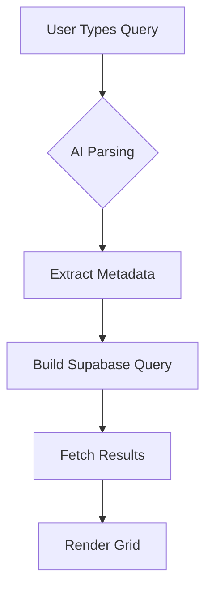
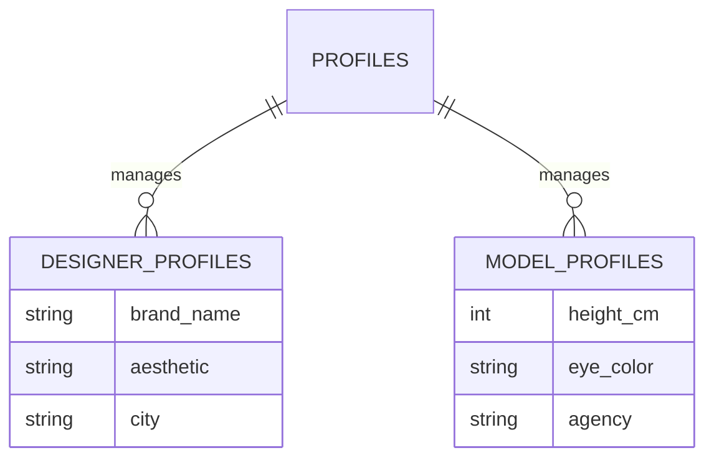
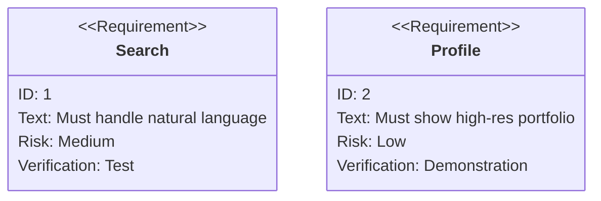

# 🪄 **Task 07: Directory & Talent Network**

**Status:** 🟢 Planned
**Priority:** P1
**Owner:** Frontend

---

## **1. Context Summary**

The Directory is the discovery engine for FashionOS (`/directory`).
It allows users to find Models, Photographers, and Venues.
It features **AI-powered Search**, advanced filtering, and rich profile details (`/directory/:id`).

---

## **2. Prerequisites (Reuse First)**

1.  `components/FadeIn.tsx`
2.  `components/Button.tsx`
3.  Gemini: `embedding` (Semantic Search) or `text-generation` (Filter extraction)
4.  Supabase: `designer_profiles`, `model_profiles`, `venues`

---

## **3. Multistep Development Prompts**

### **Iteration 1 — Profile Detail Page**

**Goal:** Rich Presentation
**Prompt:**
1.  Create `pages/public/ProfileDetailPage.tsx`.
2.  Layout: Hero Header (Cover Image + Avatar) -> Stats Row -> Portfolio Grid -> Bio/Tags.
3.  "Hire Me" button opens a contact modal.
4.  Connect to Supabase to fetch data based on URL ID.

### **Iteration 2 — Advanced Search UI**

**Goal:** Discovery
**Prompt:**
1.  Update `DirectoryPage.tsx`.
2.  Add Filter Sidebar (Desktop) / Drawer (Mobile).
3.  Filters: Role, Location, Rate Range, Availability.
4.  Grid/List view toggle.

### **Iteration 3 — AI Semantic Search**

**Goal:** Intelligent Query
**Prompt:**
1.  Search Input: "Find me a moody photographer in Brooklyn under $2k".
2.  **Gemini Logic:** Parse query -> Extract filters `{ role: 'photographer', location: 'Brooklyn', style: 'moody', budget_max: 2000 }`.
3.  Apply these filters to the Supabase query automatically.

---

### **Success Criteria for This Task**

*   [ ] Profile pages render dynamic data
*   [ ] Search input correctly filters the list
*   [ ] Grid matches the premium aesthetic (aspect ratios consistent)
*   [ ] "Hire Me" creates a record in `messages` table

---

### **Production-Ready Checklist**

*   [ ] Schema validated
*   [ ] Supabase RLS confirmed (Public read, Owner write)
*   [ ] Image optimization (Lazy loading portfolio)
*   [ ] Mobile layout tested

---

## **4. Architecture & Data Flow**

### ✔ Flowchart (Search Logic)

### ✔ ERD (Directory Entities)

### ✔ Requirement Diagram

