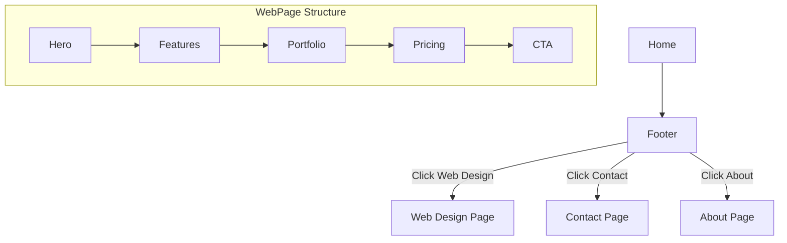

# Task: Missing Content & Service Pages

**Status:** Planned  
**Priority:** P2  
**Owner:** Frontend  

## 1. Context Summary
Several links in the footer and navbar redirect to generic pages or placeholders. To improve SEO and trust, we need dedicated pages for "Web Design", "About Us", "Contact", and "Pricing".

## 2. Multistep Development Prompt

### Iteration 1: Web Design Service Page
1.  **Page:** Create `pages/public/WebDesignPage.tsx`.
2.  **Content:** Clone the structure of `VideoProductionPage` but adapt for Digital/Web.
    *   *Hero:* "Digital Storefronts for Luxury Brands".
    *   *Features:* Shopify, Headless, UX/UI, 3D Product Viewers.
    *   *Portfolio:* Screenshots of website projects.
    *   *Packages:* "Landing Page", "Shopify Store", "Custom Build".

### Iteration 2: Core Company Pages
1.  **Contact Page:** Create `pages/public/ContactPage.tsx`.
    *   Map component (static image or embed).
    *   Detailed form (Sales vs Support).
    *   Office addresses (London, NYC, Medellín).
2.  **About Page:** Create `pages/public/AboutPage.tsx`.
    *   Mission statement.
    *   Team grid (Founders, Key Staff).
    *   "Join the Team" CTA.

### Iteration 3: Pricing & FAQ
1.  **Pricing Page:** Create `pages/public/PricingPage.tsx`.
    *   Comparison table of "Ad-hoc" vs "Membership/Retainer".
    *   FAQ Accordion component.
2.  **Routing:** Update `App.tsx` and `Footer.tsx` to link to these new real pages.

## 3. Success Criteria
- [ ] `/services/web-design` renders a specific Web Design landing page.
- [ ] `/contact` shows a dedicated contact form and map.
- [ ] `/about` shows team info.
- [ ] No links in Navbar/Footer point to placeholders or generic redirects.

## 4. Production Checklist
- **SEO:** Each page needs a unique `<h1>` and semantic structure.
- **Assets:** Use relevant Unsplash images for Web Design (laptops, code, wireframes).
- **Consistency:** Reuse `SectionTag`, `FadeIn`, and `Button` components.

## 5. Testing Plan
1.  **Link Check:** Click "Web Design" in footer. Verify it goes to new page.
2.  **Visual Check:** Ensure the "Web Design" page follows the same spacing/typography as "Photography".
3.  **Form Check:** Submit the form on `/contact`. Verify visual feedback.

## 6. Diagrams

