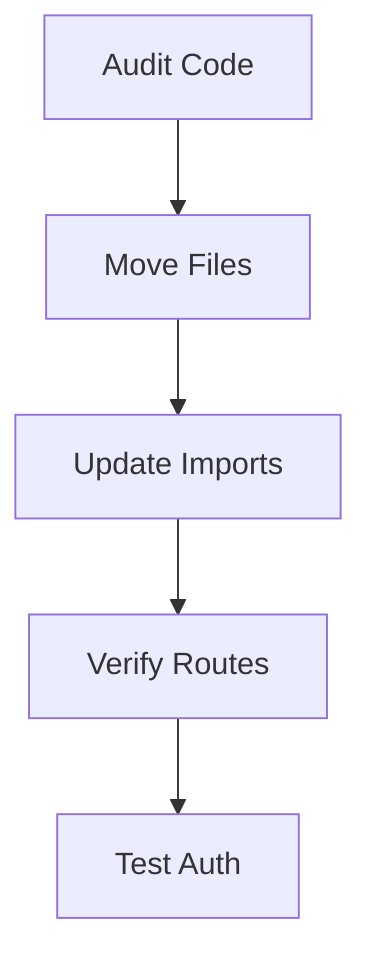

# 🪄 **Task 19: Refactor Plan Execution**

**Status:** 🟢 Planned
**Priority:** P2
**Owner:** Tech Lead

---

## **1. Context Summary**

This task tracks the architectural refactoring of the codebase.
It ensures the transition from "Monolith MVP" to "Modular Production App" follows the plan in `docs/refactor-plan.md`.

---

## **2. Prerequisites**

1.  `docs/refactor-plan.md`.
2.  Current codebase state.

---

## **3. Multistep Execution**

### **Phase 1 — Directory Restructure**

**Goal:** Separation of concerns.
**Action:**
1.  Split `pages` into `public` and `dashboard`.
2.  Move shared components to `components/ui`.
3.  Create `layouts` directory.

### **Phase 2 — Routing & Auth**

**Goal:** Security.
**Action:**
1.  Implement `RequireAuth` wrapper.
2.  Define strict Public vs Private routes in `App.tsx`.

---

## **4. Architecture & Data Flow**

### ✔ Flowchart (Refactor)

