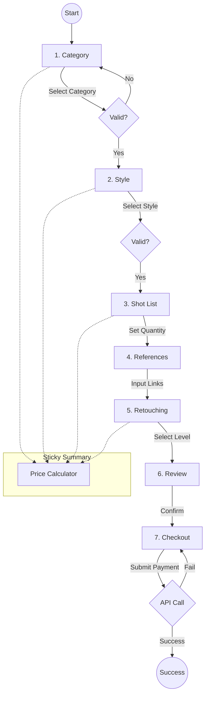
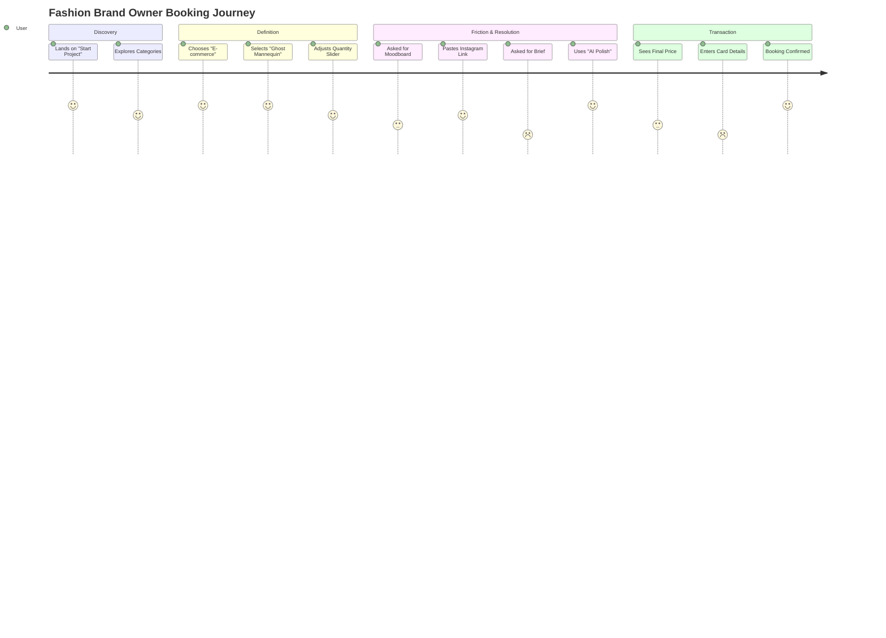
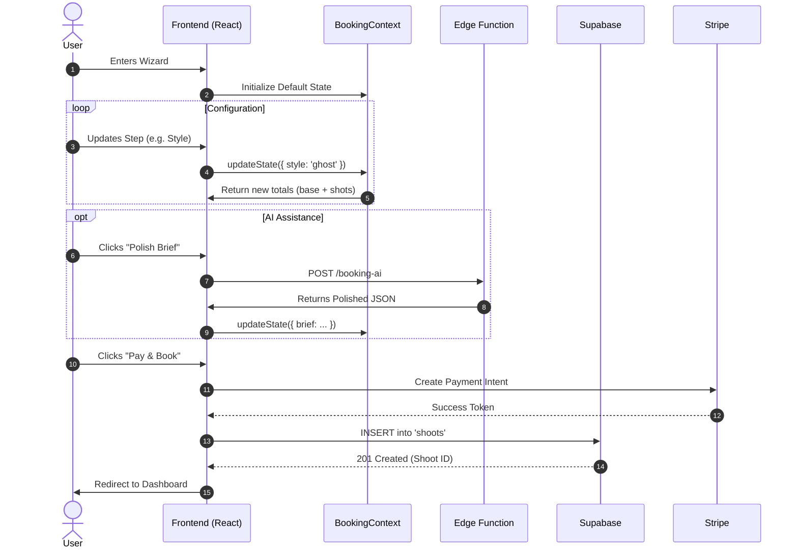

# 📐 FashionOS Booking Wizard - UX Architecture

**Version:** 1.0
**Updated:** 2025-03-03

This document outlines the User Experience flows, System Architecture, and Logic Gates for the 7-step Booking Wizard.

---

## 1. 🗺️ Master Booking Flow

The booking wizard is a linear process with state persistence handled by `BookingContext`. Users can navigate backward to edit, but forward navigation is gated by validation.

---

## 2. 🚦 Step Checkpoints & Validation

| Step | Component | Required Data | Validation Rule | Action on Fail |
| :--- | :--- | :--- | :--- | :--- |
| **1. Category** | `StepCategory` | `state.category` | Must be non-null string | "Next" button disabled |
| **2. Style** | `StepStyle` | `state.style` | Must be non-null string | "Next" button disabled |
| **3. Quantity** | `StepShotList` | `state.shotCount` | Integer > 0 | Slider min is 1 (Always valid) |
| **4. References** | `StepReferences` | `state.references` | Array (Optional) | None (Optional step) |
| **5. Retouching** | `StepRetouching` | `state.retouching` | 'basic' OR 'high-end' | Default is 'basic' |
| **6. Review** | `StepReview` | Full State | All previous valid | Redirect to error step if data missing |
| **7. Checkout** | `StepCheckout` | Contact Form | Email regex, Name > 2 chars | Shake animation + Red border |

---

## 3. 🛤️ User Journey & Emotion Map

---

## 4. ⚙️ System Sequence Diagram

This details the data exchange between the Client, Logic Layer, and Database.

---

## 5. 📝 Analysis: Pain Points & Opportunities

### Current Pain Points
1.  **Visual Context:** Users might not know the difference between "Ghost Mannequin" and "Flat Lay" without seeing examples of *their specific product type*.
2.  **Price Shock:** Users might be surprised by the total at the end if they don't watch the sidebar closely.
3.  **Scheduling:** The current flow assumes open availability. A user might book a date that is actually full.

### Opportunities for V2
1.  **Visualizer:** When selecting "Ghost Mannequin", update the preview image to match the user's category (e.g., show a ghost mannequin *dress* if they selected Dresses).
2.  **Dynamic Bundles:** If user selects > 50 shots, offer a "Full Day Rate" discount popup automatically.
3.  **Real-time Calendar:** Integrate the `StepCheckout` with a real-time calendar check against the Studio's Google Calendar to prevent double-booking.

