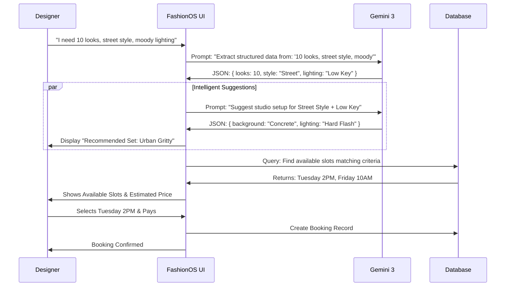

# 📸 FashionOS – Fashion Shoot Booking Platform Plan

## 1. MVP Overview

*   **Vision:** To become the "Airbnb for Fashion Production"—a streamlined operating system where designers can book high-end photo and video shoots in clicks, not email chains.
*   **Primary Users:**
    *   **Fashion Designers/Brands:** Need high-quality assets for e-commerce and social media but lack time/production expertise.
    *   **Studios/Photographers:** Need a steady stream of bookings without the administrative burden of quoting and scheduling.
*   **Problem Solved:** Eliminates the friction of manual quoting, endless scheduling emails, vague creative briefs, and scattered asset delivery.

---

## 2. Phase 1 — MVP Core Setup

**Goal:** A transactional platform where a designer can discover a package, customize it slightly, pay, and receive assets.

### A. MVP Features
*   **Marketing Site:**
    *   **Service Menu:** Clear distinction between "E-commerce (White background)" and "Editorial (Lifestyle)."
    *   **Transparent Pricing:** Calculator based on (Number of Looks × Cost per Look) + Add-ons.
    *   **Portfolio Gallery:** High-quality examples of past work.
*   **Booking Wizard (The Core):**
    *   **Step 1: Scope:** Select Photo vs. Video vs. Hybrid.
    *   **Step 2: Category:** Select Lookbook, E-commerce, or Social Reels.
    *   **Step 3: Volume:** Input number of outfits/SKUs.
    *   **Step 4: Brief:** AI-assisted text box for creative direction.
    *   **Step 5: Logistics:** Select Date/Time slot and Location (Studio A or B).
    *   **Step 6: Payment:** Stripe integration for deposit or full payment.
*   **Designer Dashboard:**
    *   **Active Shoots:** Timeline status (Booked → Shooting → Editing → Ready).
    *   **Asset Library:** Simple grid view to download final high-res files.
*   **Admin Dashboard:**
    *   **Calendar View:** Master schedule of all shoots.
    *   **Booking Management:** Approve/Reschedule requests.

### B. MVP Pages & Screens
1.  **Landing Page:** Value prop, featured packages, "Book Now" CTA.
2.  **Services & Pricing:** Detailed breakdown of what's included in a "Look" (steaming, styling, shooting, retouching).
3.  **The Booking Wizard (Multi-step form):** The primary functional engine.
4.  **Auth Screens:** Sign up / Login (via Email or Google).
5.  **Client Dashboard:** "My Shoots" list and "Shoot Details" view.
6.  **Asset Delivery View:** A clean gallery page to view proofs and download finals.
7.  **Admin Panel:** Internal view for studio staff to manage logistics.

### C. MVP Data Model (High Level)
*   **Users:** `id`, `role` (designer/admin), `brand_name`.
*   **Shoots:** `id`, `user_id`, `status` (pending, confirmed, shooting, delivered), `shoot_date`, `type` (ecomm, editorial).
*   **Shoot_Items:** `id`, `shoot_id`, `garment_description`, `special_instructions` (e.g., "Focus on zipper detail").
*   **Assets:** `id`, `shoot_id`, `url` (Cloudinary/S3), `type` (image/video), `tags`.
*   **Transactions:** `id`, `shoot_id`, `amount`, `status`.

### D. MVP AI Usage (Gemini 3 Flash)
*   **Feature 1: The "Brief Polisher"**
    *   **Input:** User types messy notes: *"I want edgy vibes, kinda dark, like Balenciaga street style."*
    *   **Output:** Clean, professional text: *"Aesthetic: Edgy/Industrial. Mood: Moody, high-contrast. Reference Style: High-end streetwear."*
    *   **UI:** A "Polish with AI" button in the Booking Wizard.
*   **Feature 2: Automated Tagging**
    *   **Input:** User uploads a reference image or enters text.
    *   **Output:** JSON tags for the database: `["dark_mode", "streetwear", "high_contrast"]`.
    *   **UI:** Hidden background process to help Admins categorize bookings.
*   **Feature 3: Intelligent Set Design**
    *   **Input:** User selects Category (e.g., "Streetwear") and Mood (e.g., "High Energy").
    *   **Output:** Suggested lighting setups (e.g., "Hard flash with color gels") and background textures (e.g., "Concrete wall", "Seamless Grey").
    *   **UI:** A "Recommended Sets" carousel in the Studio/Location selection step, allowing users to visualize the vibe before booking.

---

## 3. Phase 2 — Advanced Features Plan

### A. Advanced Planning & Briefing (The "AI Art Director")
*   **Visual Style Analyzer:** Designer uploads their mood board or links their Instagram. AI analyzes the visual semantic style (color palette, lighting key, composition) and suggests the best photographer/studio match.
*   **Smart Call Sheets:** Automatically generate a PDF call sheet for the crew based on the booking details (crew names, location, weather, shot list).

### B. Scenes, Models, and Teams
*   **Model Casting Engine:** Filter models not just by height/size, but by "Vibe" (e.g., "Commercial Smile" vs. "Editorial Edge").
*   **Scene Builder:** Digital visualization of the set. Select background color, props, and lighting setup during booking.

### C. Photo + Video Packs
*   **"The Viral Pack":** A pre-configured bundle optimized for TikTok (5 vertical videos, trending audio suggestions, quick cuts).
*   **"The Shopify Pack":** Standardized 4-shot sequence (Front, Back, Detail, Lifestyle) that integrates directly into Shopify CSV export.

### D. Delivery & Asset Intelligence
*   **AI Metadata:** Automatically tag final assets with garment features (e.g., "Silk", "Red Dress", "V-Neck") for easier Digital Asset Management (DAM).
*   **Smart Crop:** AI auto-crops high-res images into 4:5 (IG Feed), 9:16 (Stories), and 1:1 (Square) versions automatically.

### E. Membership & Business
*   **"FashionOS Pro":** Monthly subscription for reduced rates and 24h turnaround.
*   **Teams:** Allow a Creative Director to book the shoot and an Assistant to upload the clothes list.

---

## 4. Gemini 3 Integration Table

| Feature / Tool | Screen / Flow | Input | Output | Benefit |
| :--- | :--- | :--- | :--- | :--- |
| **Text Generation** | Booking Wizard | Messy user notes ("need pop colors, fun vibe") | Structured Professional Brief | Reduces back-and-forth emails clarifying the client's vision. |
| **Structured Output (JSON)** | Shoot Planner | Raw text description of collection | JSON Shot List `[{ "look": 1, "items": ["red dress"], "angles": ["full", "detail"] }]` | Converts creative text into actionable logistical data for the crew. |
| **Vision (Multimodal)** | Style Setup | User uploads a PDF Brand Guide or Moodboard Image | Extracted Style Parameters (Hex Codes, Lighting Style) | Ensures the shoot adheres to brand guidelines without manual review. |
| **URL Context** | Onboarding | Designer provides Website URL | Brand Profile Summary & Recommended Packages | Personalizes the experience immediately ("We see you sell jewelry, here is our Macro Pack"). |
| **Function Calling** | Chatbot / Copilot | "Is the studio free next Tuesday?" | Triggers `checkAvailability(date)` and returns answer | Allows natural language booking and availability checks. |
| **Google Search Grounding** | Trend Report | "What are trending e-comm styles?" | Summary of current visual trends (e.g., "Hard flash, Y2K aesthetic") | Positions FashionOS as a strategic partner, not just a service provider. |
| **Set Recommendation** | Studio Selection | Category="Streetwear", Mood="Moody" | `["Concrete Wall", "Hard Flash", "Neon Props"]` | Helps inexperienced designers select professional-grade environments that match their vision. |

---

## 5. User Journey Flow (Mermaid)

```mermaid
graph TD
    A[Designer Lands on Home] --> B{Has Account?}
    B -- No --> C[Sign Up / Onboarding]
    B -- Yes --> D[Dashboard]
    
    C --> C1[AI Scans Brand URL]
    C1 --> C2[Suggests Profile Settings]
    C2 --> D
    
    D --> E[Click 'New Booking']
    
    subgraph "The Booking Wizard"
        E --> F[Select Shoot Type]
        F --> G[Input Quantity & Dates]
        G --> H[Creative Briefing]
        H --> H1[User types messy ideas]
        H1 -- Gemini Flash --> H2[AI Polishes Brief]
        H2 --> I[Review & Confirm]
    end
    
    I --> J[Payment (Stripe)]
    J --> K[Booking Confirmed]
    K --> L[Admin/Studio Notification]
    
    L --> M[Shoot Day Executed]
    M --> N[Assets Uploaded]
    
    N -- Gemini Pro Vision --> O[AI Auto-Tagging]
    O --> P[Designer Receives Assets]
```

### 6. Booking Logic Detail (Mermaid)


